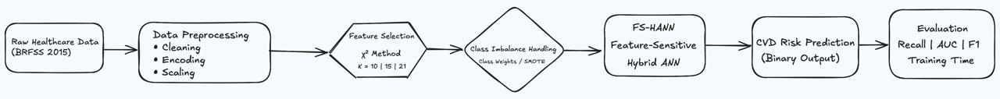
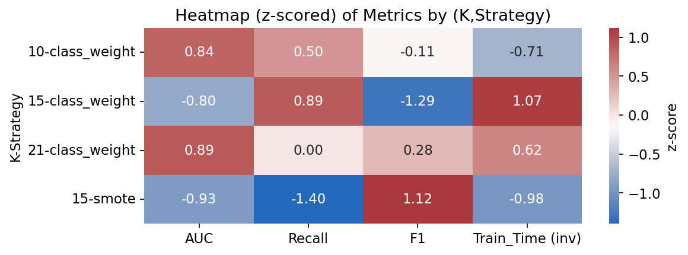
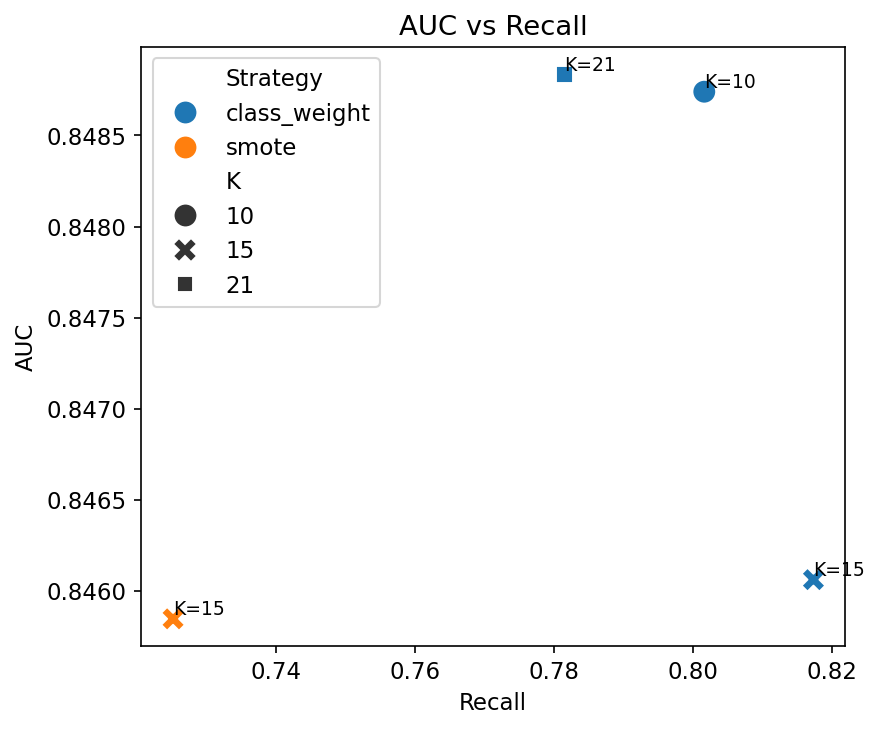

# FS-HANN: Feature-Sensitive Hybrid Artificial Neural Network

## Overview
FS-HANN is a Feature-Sensitive Hybrid Artificial Neural Network developed for
cardiovascular disease (CVD) prediction using the BRFSS 2015 dataset.
The project prioritizes **high recall (sensitivity)** while maintaining **computational efficiency**,
making it suitable for real-world healthcare screening scenarios.

---

## Problem Context
In medical prediction tasks, false negatives are costly.
Many existing deep learning and ensemble-based approaches achieve strong accuracy
but are computationally expensive and difficult to deploy.

FS-HANN addresses this by:
- reducing feature redundancy through statistical feature selection
- explicitly handling severe class imbalance
- designing a lightweight ANN architecture focused on recall optimization

---

## Dataset
- **Source:** BRFSS 2015 (CDC)
- **Task:** Binary classification (CVD / No CVD)
- **Imbalance:** ~9:1 (Negative : Positive)
- **Features used:** 15 (χ²-based feature selection)
- **Imbalance handling:** Class Weights

> The dataset is not included in this repository due to size constraints.

---

## FS-HANN Pipeline


---

## Model Architecture
- Input layer defined by selected feature subset (K = 15)
- Feature-sensitive hidden layers with regularization
- Tapered Hybrid ANN design for efficiency
- Sigmoid output layer for binary classification

---

## Results Overview

**Performance trade-offs across feature sizes and imbalance strategies (z-scored):**



**AUC vs Recall comparison highlighting recall-driven configurations:**



### Key Metrics (Optimal Configuration)
- **AUC:** 0.8476  
- **Recall:** 0.8067  
- **Training Time:** Reduced by ~15% compared to full-feature baseline  

These results validate that strategic dimensionality reduction can preserve predictive
performance while improving efficiency.

---

## Documentation
- 📄 [Case Study – Deployable FS-HANN](docs/CaseStudy.pdf)
- 📘 [Comprehensive Paper](docs/Comprehensive_Paper_FS-HANN.pdf)

---

## How to Run
1. Clone the repository:
   ```bash
   git clone https://github.com/<your-username>/FS-HANN.git
   cd FS-HANN
